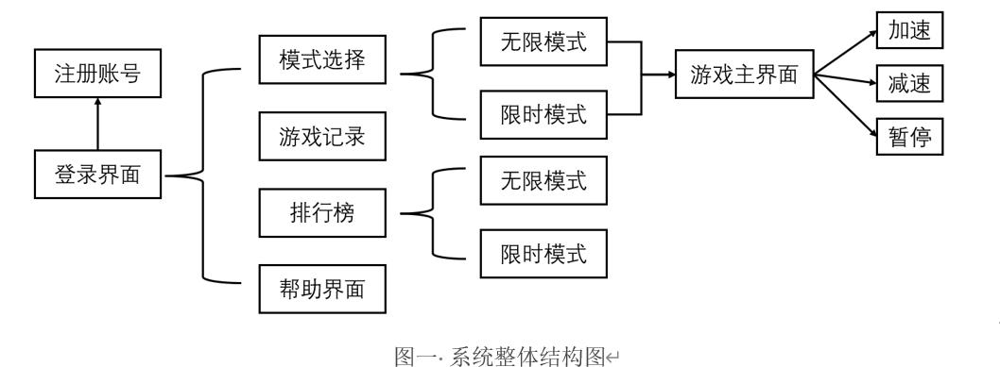
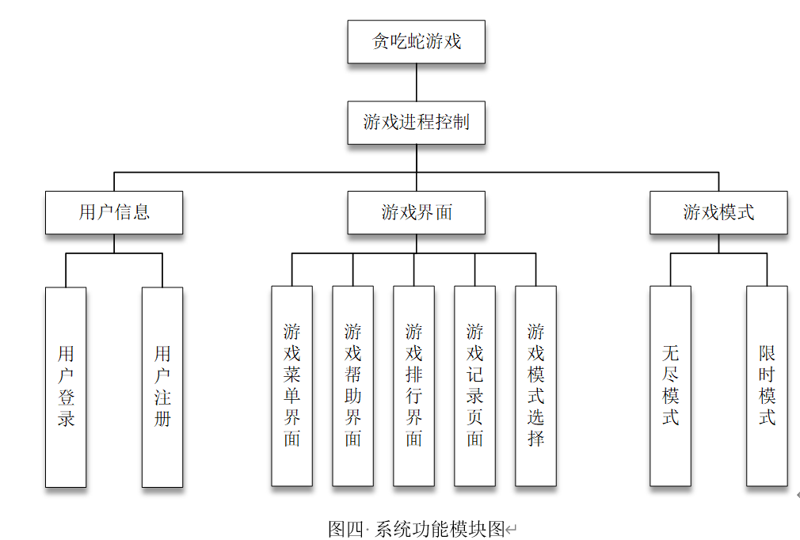
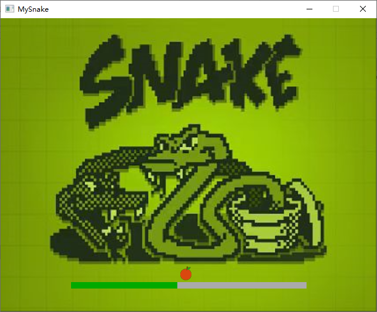
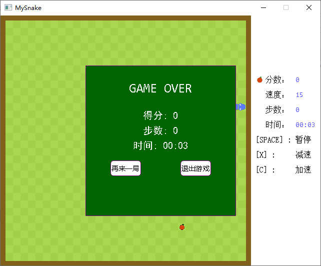
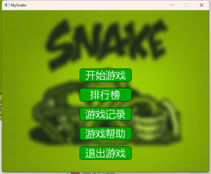
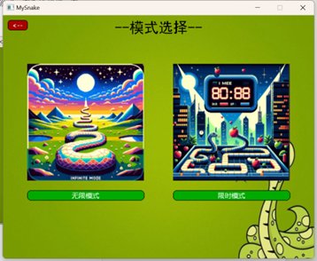
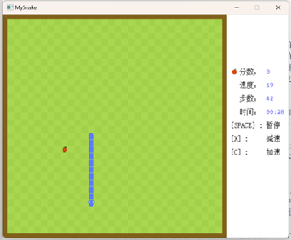
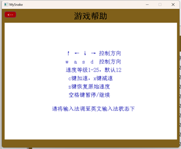

# MySnake - 基于 C++ 和 EasyX 的贪吃蛇游戏

## 📖 项目简介

本项目是基于 **C++** 语言和 **EasyX 图形库** 开发的经典贪吃蛇游戏 。除了基础的游戏逻辑外，系统还实现了完整的用户管理、模式选择以及数据持久化功能 。

这是我大一完成的C++课程设计，该项目旨在练习 C++ 的面向对象编程思想（如继承与多态），并结合图形库处理复杂的 UI 交互与逻辑控制 。

## ✨ 核心功能

- **用户系统**：支持用户注册与登录，账号密码信息加密处理并持久化存储 。
- **多样模式**：
    - **无限模式**：经典玩法，蛇身随进食变长，直至发生碰撞 。
    - **限时模式**：在规定时间内争取最高得分 。
- **交互控制**：
    - 支持键盘方向键或 `WASD` 控制移动 。
    - 支持实时加速 (`C`)、减速 (`X`) 及恢复原始速度 (`Z`) 。
    - 具备游戏暂停 (`空格`) 与继续功能，支持暂停画面的保存与恢复 。
- **数据管理**：
    - **排行榜**：根据得分与用时展示全服前三名 。
    - **游戏记录**：记录个人历史得分、步数及游戏时间，数据以 CSV 格式存储 。
## 🛠️ 环境要求
- **编程语言**：C++
- **图形库**：EasyX (Windows)，前往 [EasyX 官网](https://easyx.cn/) 下载并安装对应版本的库文件 。
- **开发环境**：Visual Studio 2022+
- **操作系统**：Windows 10 或更高版本
## 📂 项目结构
```bash
.
├── MySnake                      # 项目主程序文件夹
│   ├── Button.cpp               # 按钮控件实现：绘制、点击事件处理 
│   ├── Button.h                 # 按钮类定义 
│   ├── ClassDiagram.cd        # Visual Studio 生成的类图文件
│   ├── Food.cpp                 # 食物类实现：随机生成与状态管理 
│   ├── Food.h                   # 食物类定义 
│   ├── GameControl.cpp          # 游戏控制类实现
│   ├── GameControl.h            # 游戏控制类定义 
│   ├── GameMode.cpp             # 游戏模式抽象基类实现
│   ├── GameMode.h             # 游戏模式基类定义
│   ├── InfiniteMode.cpp        # 无限模式实现：具体游戏运行逻辑 
│   ├── InfiniteMode.h           # 无限模式类定义
│   ├── Map.cpp                # 地图类实现：
│   ├── Map.h                    # 地图类定义
│   ├── MySnake.aps              # 二进制资源辅助文件
│   ├── MySnake.rc               # 资源脚本文件：定义图标、版本信息等
│   ├── MySnake.vcxproj          # Visual Studio 项目文件
│   ├── MySnake.vcxproj.filters  # 项目过滤器文件
│   ├── MySnake.vcxproj.user     # 用户特定项目设置
│   ├── Resource.aps             # 资源辅助文件
│   ├── Snake.cpp                # 蛇类实现
│   ├── Snake.h                  # 蛇类定义
│   ├── TimedMode.cpp            # 限时模式实现
│   ├── TimedMode.h              # 限时模式类定义
│   ├── common.cpp               # 通用工具函数实现 
│   ├── common.h                 # 通用定义：包含宏、结构体等
│   ├── main.cpp                 # 程序入口文件：启动 MainLoop 
│   ├── res                      # 静态资源总目录 
│   │   ├── GameRecord           # 数据存储目录
│   │   │   └── gameRecord.csv   # 游戏历史记录
│   │   ├── Graphics/            # 贴图资源：蛇头、身体、食物图片 
│   │   └── Sound/               # 音频资源
│   ├── resource.h               # 资源头文件：定义资源 ID
│   └── resource1.h              # 备份或扩展资源头文件
└── MySnake.sln                  # Visual Studio 解决方案文件
```


## 程序实况





